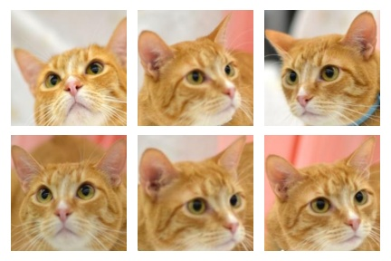
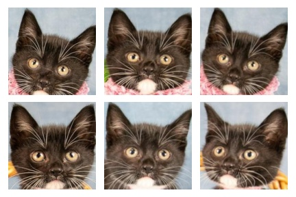
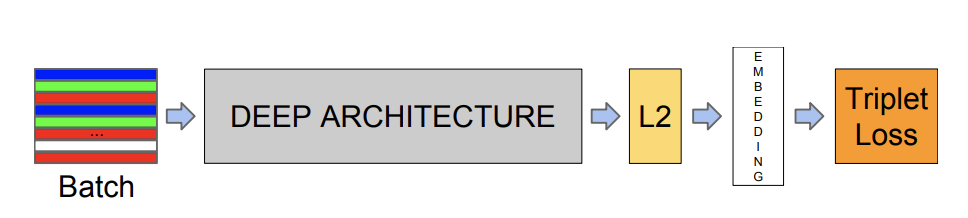

# NekoNet
### Overview
This PyTorch repo contains:
- Mostly code and tools [we](https://github.com/L-E-G-s) built to train triplet loss ConvNets that learn vector descriptors for images of cat faces. 
- The cat face dataset we mined and used for training.
- Some models we trained using the framework.

Our work was much inspired by [Adam Klein's report](http://cs230.stanford.edu/projects_fall_2019/reports/26251543.pdf).

Our team's original intent was focused on the cat stuff only, but we believe these tools can be used for training embedding extractor of other objects (e.g., human faces) as long as you have the data.

### Table of contents
1. [Methodology overview](#methodology-overview)
    * [The cat face dataset](#cat-face-dataset)
    * [Model structure and techniques](#model-structure-and-techniques)
2. [Installation](#installation)
3. [Pretrained models](#pretrained-models)
4. [Training your own network](#training-your-own-network)

### Methodology overview
#### Cat face dataset
We ran queries on [petfinder API](https://www.petfinder.com/developers/v2/docs/) to collect images of cats, grouped by their unique IDs. A cat face detector was trained using [YOLOv5](https://github.com/ultralytics/yolov5) to crop out the faces. We fixed/removed bad classes which either contain images of different cats or non-face images. All images were then resized to 224x224. The dataset after these preprocessing steps now has 7,229 classes of 34,906 images.

There was a problem with the dataset that we could not fix. Although we collected images based on the unique IDs of the cats, there were duplicate classes (different cat IDs but contain the same/similar set of images of a single actual cat).

#### Model structure and techniques
For each face image, we wanted to produce a feature vector that abstractly captures its unique identity. To achieve that, we used [triplet loss](https://arxiv.org/abs/1503.03832) as the criterion. The distance metric used was Euclidean distance.

The structure of a simple model would consist of a CNN backbone followed by a fully-connected layer. The output would then be L2-normalized to extract the final embedding.

### Installation
### Pretrained models
### Training your own network

